# Pub Manager
Frontend napisany jest w języku programowania JavaScript w oparciu o bibliotekę React. Aplikacja składa się z komponentów, które tworzą interfejs użytkownika. Aplikacja posiada podstawowe stylowanie i jest responsywna umożliwiając korzystanie z niej zarówno na urządzeniach mobilnych jak i na desktopie.
## Stack technologiczny
### Baza danych
Relacyjna baza danych mySQL w wersji 8.3
### Backend
Python – framework Flask
### Frontend
Javascript – biblioteka React 

# Live preview

https://projekt-pub-fe.onrender.com/

### Aplikacja podzielona jest na widoki:

•	Tables – wyświetla listę stolików i umożliwia zarządzanie nimi 

•	Show Order – wyświetla podsumowanie zamówienia oraz umożliwia przejście do widoku dodawania pozycji do zamówienia 

•	Add To Order – wyświetla listę drinków z możliwością dodania ich do koszyka i następnie do zamówienia 

•	Menu – wyświetla menu z listą drinków, ich ceną, opisem i zdjęciem 

•	Orders – wyświetla listę zamówień wraz z informacjami 

•	Storage – wyświetla listę składników raz z ich stanem magazynowym, zdjęciem oraz możliwością dodania poszczególnych składników do magazynu

## Widoki
### Tables
#### Lista wszystkich stolików w Pubie
 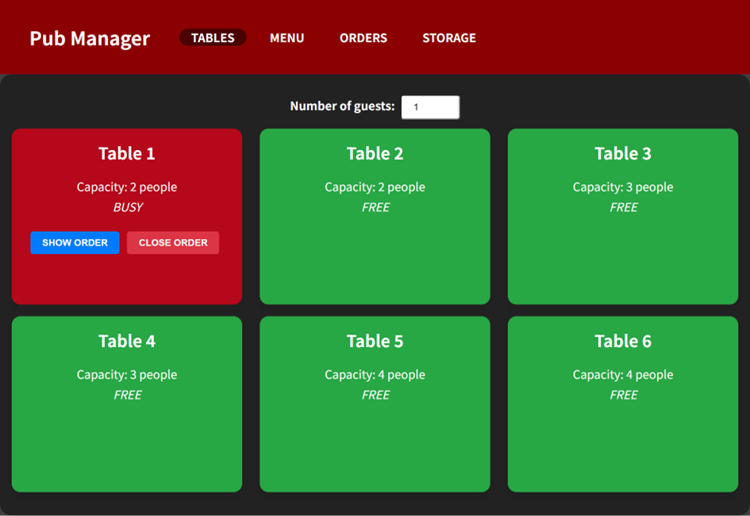

#### Lista stolików – widok mobilny
 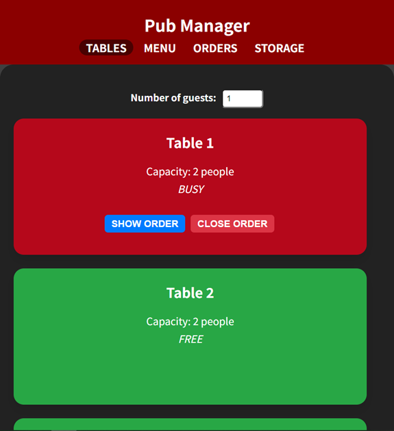

#### Możliwość filtrowania stolików ze względu na ich pojemność
 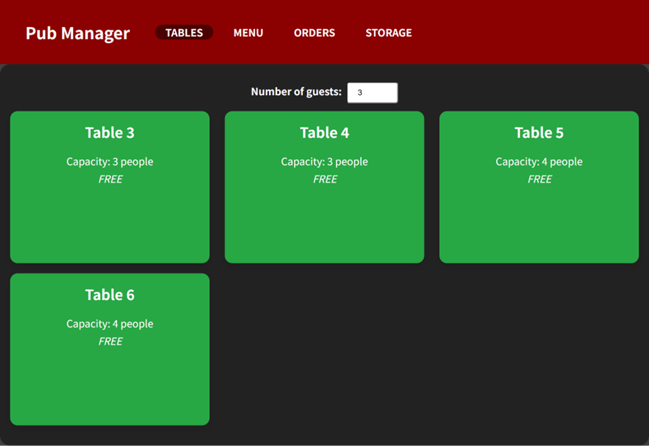
#### Rezerwacja stolika możliwa po kliknięciu na odpowiedni kafelek
 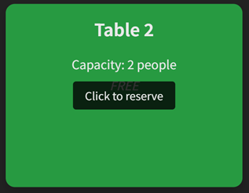
### Show order
#### Podsumowanie zamówienia
 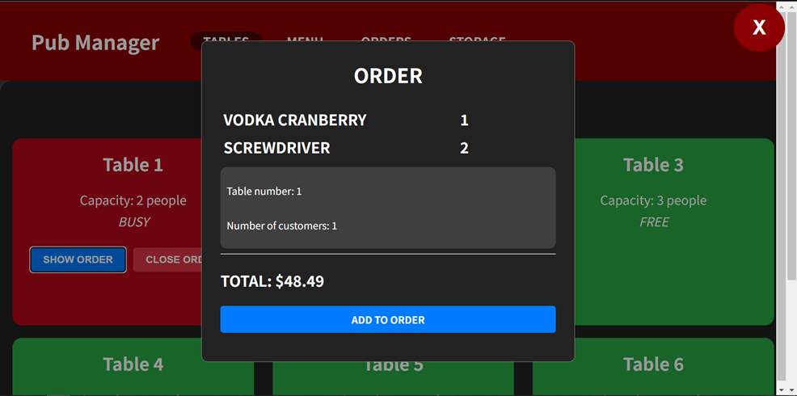
### Add to order
#### Wyświetlanie menu drinków z możliwością dodania drinka do koszyka 

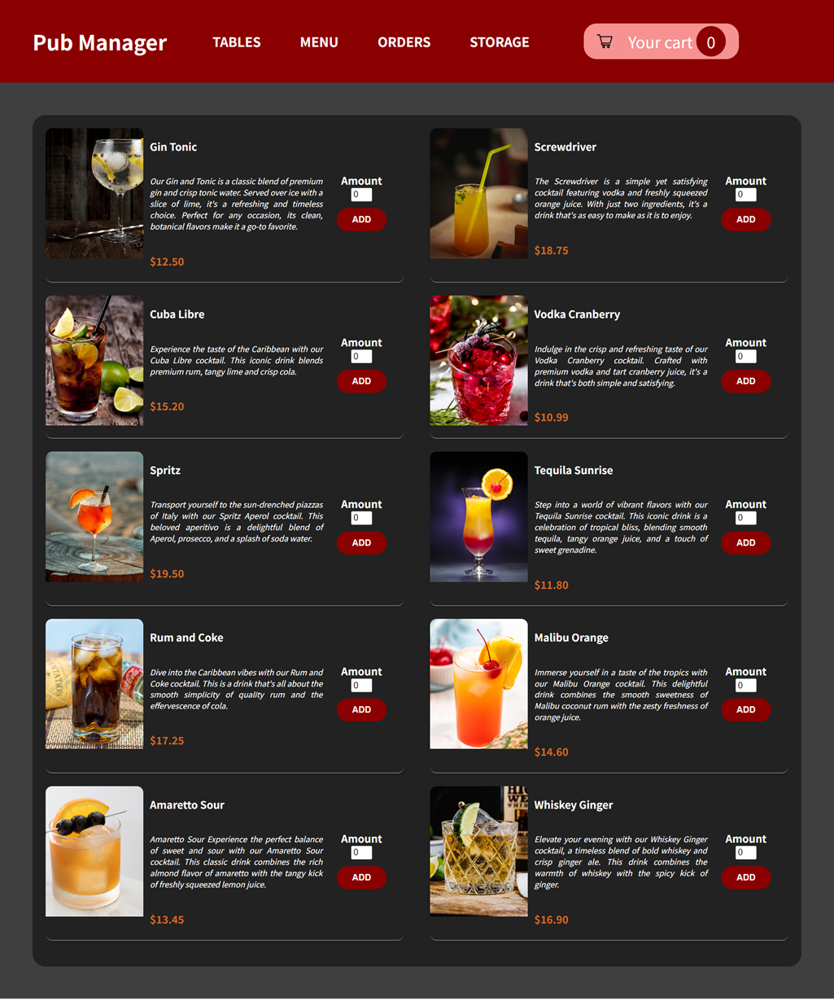

#### Wyświetlanie menu drinków z możliwością dodania drinka do koszyka – widok mobilny
 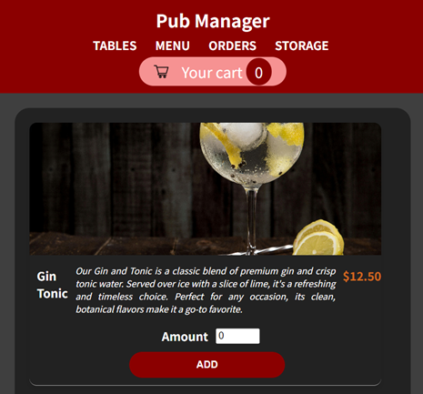

#### Dodawanie drinka do koszyka
 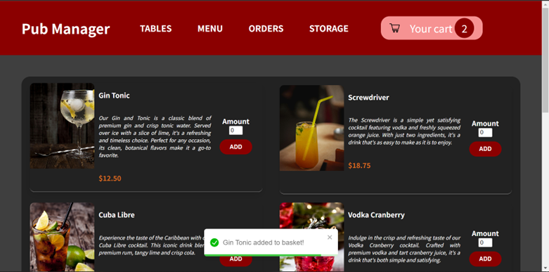
#### Widok koszyka
 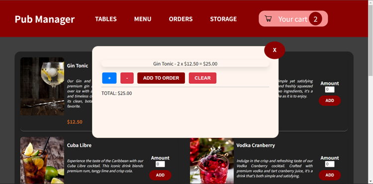
#### Komunikat o prawidłowym dodaniu drinka do zamówienia
 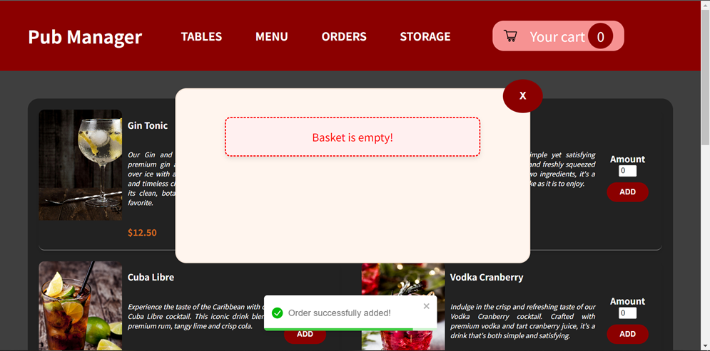

#### Komunikat o błędzie – niewystarczająca ilość składników do realizacji zamówienia
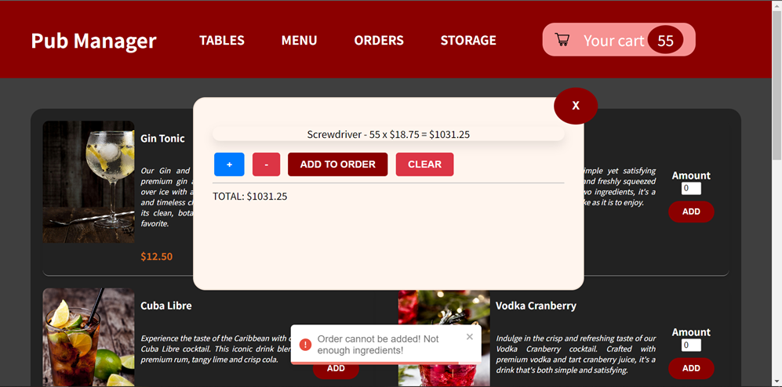
### Menu
#### Widok menu dostępnych drinków raz z cenami, opisami i zdjęciami
 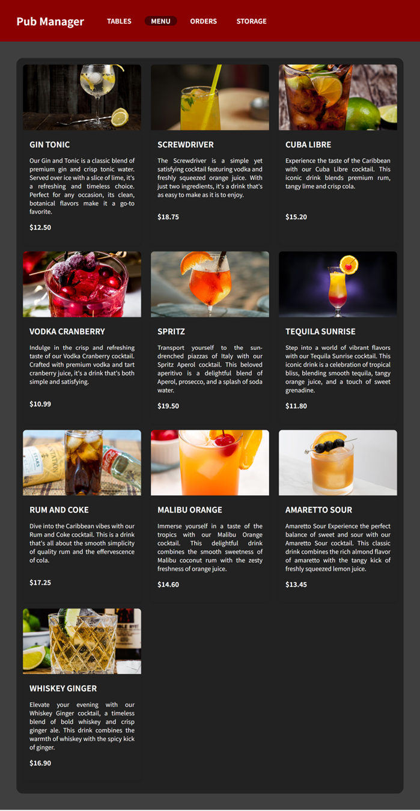
#### Menu drinków – widok mobilny
 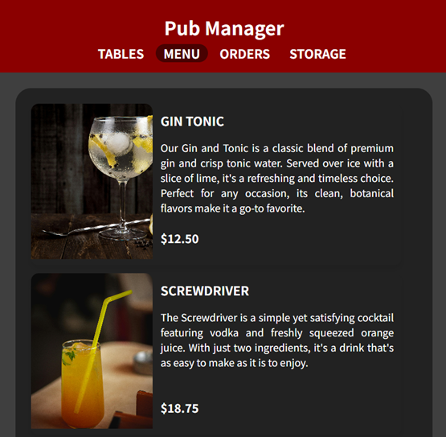
### Orders
#### Widok zamówień
 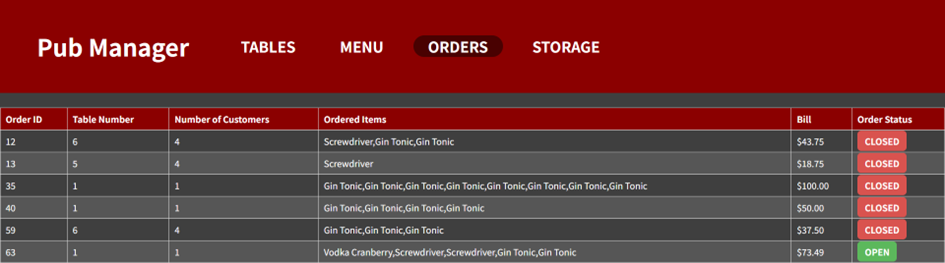
#### Zamówienia – widok mobilny
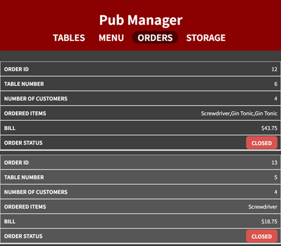
### Storage
#### Widok składników wraz z ich stanem magazynowym
 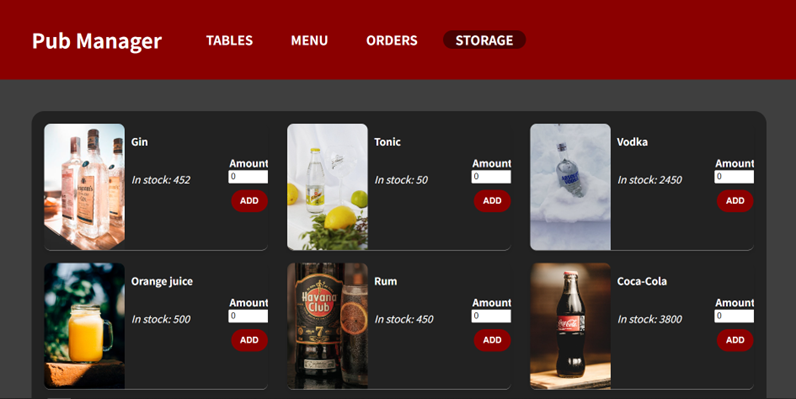
#### Składniki – widok mobilny
 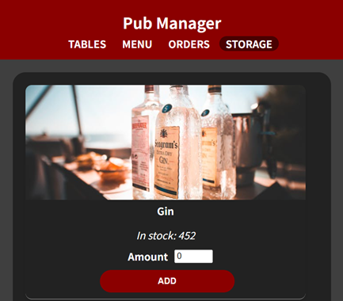
#### Informacja o pomyślnym dodaniu składnika do stanu magazynowego
 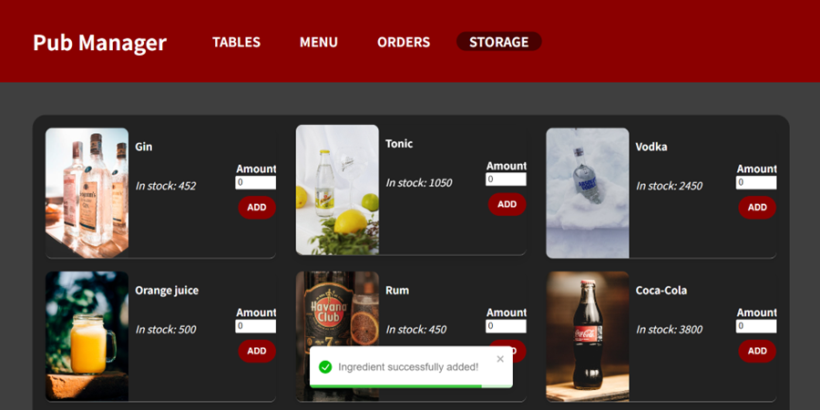

## Available Scripts

In the project directory, you can run:

### `npm start`

Runs the app in the development mode.\
Open [http://localhost:3000](http://localhost:3000) to view it in your browser.

The page will reload when you make changes.\
You may also see any lint errors in the console.

### `npm test`

Launches the test runner in the interactive watch mode.\
See the section about [running tests](https://facebook.github.io/create-react-app/docs/running-tests) for more information.

### `npm run build`

Builds the app for production to the `build` folder.\
It correctly bundles React in production mode and optimizes the build for the best performance.

The build is minified and the filenames include the hashes.\
Your app is ready to be deployed!

See the section about [deployment](https://facebook.github.io/create-react-app/docs/deployment) for more information.

### `npm run eject`

**Note: this is a one-way operation. Once you `eject`, you can't go back!**

If you aren't satisfied with the build tool and configuration choices, you can `eject` at any time. This command will remove the single build dependency from your project.

Instead, it will copy all the configuration files and the transitive dependencies (webpack, Babel, ESLint, etc) right into your project so you have full control over them. All of the commands except `eject` will still work, but they will point to the copied scripts so you can tweak them. At this point you're on your own.

You don't have to ever use `eject`. The curated feature set is suitable for small and middle deployments, and you shouldn't feel obligated to use this feature. However we understand that this tool wouldn't be useful if you couldn't customize it when you are ready for it.

## Learn More

You can learn more in the [Create React MenuView documentation](https://facebook.github.io/create-react-app/docs/getting-started).

To learn React, check out the [React documentation](https://reactjs.org/).

### Code Splitting

This section has moved here: [https://facebook.github.io/create-react-app/docs/code-splitting](https://facebook.github.io/create-react-app/docs/code-splitting)

### Analyzing the Bundle Size

This section has moved here: [https://facebook.github.io/create-react-app/docs/analyzing-the-bundle-size](https://facebook.github.io/create-react-app/docs/analyzing-the-bundle-size)

### Making a Progressive Web MenuView

This section has moved here: [https://facebook.github.io/create-react-app/docs/making-a-progressive-web-app](https://facebook.github.io/create-react-app/docs/making-a-progressive-web-app)

### Advanced Configuration

This section has moved here: [https://facebook.github.io/create-react-app/docs/advanced-configuration](https://facebook.github.io/create-react-app/docs/advanced-configuration)

### Deployment

This section has moved here: [https://facebook.github.io/create-react-app/docs/deployment](https://facebook.github.io/create-react-app/docs/deployment)

### `npm run build` fails to minify

This section has moved here: [https://facebook.github.io/create-react-app/docs/troubleshooting#npm-run-build-fails-to-minify](https://facebook.github.io/create-react-app/docs/troubleshooting#npm-run-build-fails-to-minify)
